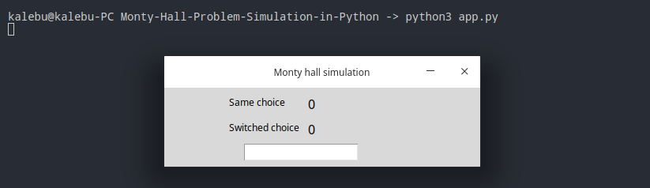

<samp>
  
# [Monty-Hall-Problem-Simulation-in-Python](https://kalebujordan.dev/simulate-monty-hall-problem-using-python/)

The repository  acts as the source code for the [Monty hall problem simulation](https://kalebujordan.dev/simulate-monty-hall-problem-using-python/)


WTH is Monty Hall Problem ?
-----------------------------
I'm a great fan of movies & thus where most of biggest motivation in STEM and coding came from, The first time I came across the Monty hall problem was when I was watching movie titled [21](https://en.wikipedia.org/wiki/21_(2008_film)).

  
>_Assume There are three doors, and behind one of them is a car, while behind the other two are goats. If you choose the door with the car behind it, you win the car. Now, say you choose Door 1. The host Monty Hall then opens either Door 2 or Door 3, behind which is a goat. (He knows what is behind each door, and never opens the door with the car behind it.) Monty now gives you the choice: do you want to stick with Door 1, or switch to the other door. What should you do? Or does it matter?

Now the battle lies *Emotion vs Math*, mathematically switching would give you a 2/3 probability of winning rather than sticking to the same door as the probabilty of winning a car among those two door would concentrate into one.


How are we going to Simulate ?
-------------------------------
In this source code I have simulated this problem using random module to simulate the process, and supringly with enough trials the probability winning when you switch converge to 0.6666.. which is equivalent to 2/3.


Getting started
-----------------
To get started running the simulation for this code, you might wanna clone or download the repository first just as shown below;

```bash
$-> git clone https://github.com/Kalebu/Monty-Hall-Problem-Simulation-in-Python

```

Open terminal in a project directory
------------------------------------

Open in a terminal in a project directory or you can just change a directory into the project directory and then run th app just as shown below;

```bash
$-> cd Monty-Hall-Problem-Simulation-in-Python
$ Monty-Hall-Problem-Simulation-in-Python-> python app.py
```

Do some simulations 
-------------------------
Once you run the application, a very simple gui similar to what shown below will pop up with an entry box, write in it no of sample to be simulated and then press enter and then program will evaluate total wins for case of same choice or switching 



Give it a star 
--------------
Did you find this information useful, then give it a star 
  
References 
-------------
  1.https://www.mathwarehouse.com/monty-hall-simulation-online/ 

Credits
-----------
All the credits to [kalebu](github.com/kalebu) 
